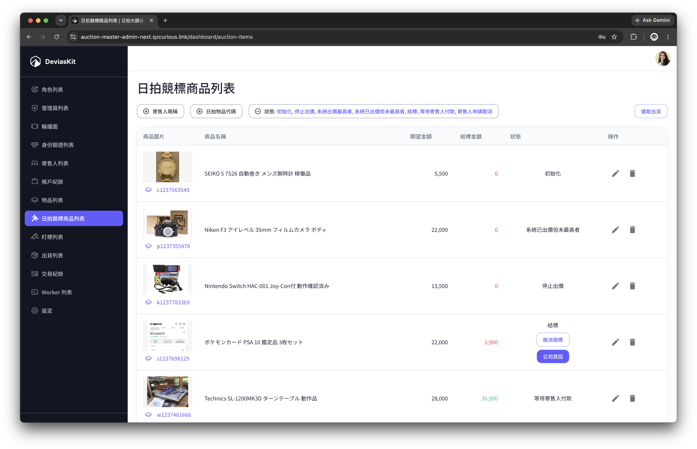

# Auction Master Admin

**Demo：<https://auction-master-admin-next.qzcurious.link/>**

Demo 提供兩組帳號，可以直接比較不同權限下的操作範圍：

- 超級管理員：`admin` / `demo-admin`
- 受限操作員：`operator` / `demo-operator`

> Demo 為展示環境，部分會修改資料的操作受到限制。

## 專案介紹

這是一套代競拍平台，包含使用者前台與營運後台。

使用者可以建立要送拍的物品，上傳多張照片、調整圖片順序並填寫完整的商品說明。送出後，物品會依實際處理進度經過審核、上架、競拍、成交等不同階段，使用者可以直接從列表看到目前狀態，也能查看每次狀態變更的紀錄。

因為同一個人可能同時有不少物品正在處理，列表提供狀態與條件篩選，篩選結果也會保留在網址上，重新整理或回到頁面時不用重新找一次。

競拍開始後，使用者可以查看競拍中的物品與結果，處理成交後的相關費用，並查詢自己的餘額與歷史紀錄。

後台則是給營運人員處理整個代競拍流程，包含物品與競拍管理、委託人審核、帳務、操作紀錄，以及首頁輪播等網站內容。不同管理人員可以設定不同權限，限制各自能看到或操作的功能。

本專案為營運後台，對應使用者前台 [auction-master-front](https://github.com/QzCurious/auction-master-front)。

## 功能

### 營運總覽

首頁集中呈現平台目前的營運狀況，包含待處理事項、成交與帳務資訊、委託人與物品數量等資料，讓管理人員進入後台後能先掌握需要處理的工作。

### 物品與競拍流程管理

物品不是單純的 CRUD 資料，而是會隨代競拍流程經過不同階段。後台可以依目前狀態管理物品、處理審核與後續操作，並保留狀態與操作紀錄，方便回頭確認一件物品曾經發生過什麼。

物品進入競拍後，則可以進一步管理競拍資料與結果，讓送件、競拍到成交後處理維持在同一套流程中。

### 委託人與身分審核

後台可管理委託人資料與身分驗證申請，讓需要人工確認的會員資料有獨立的處理入口，而不是混在一般會員資料中。

### 帳務與紀錄

提供委託人餘額、交易與相關紀錄的管理介面，讓營運端能從物品與競拍結果繼續追到後續帳務處理。

### 角色與權限

管理員可以依角色配置不同的功能權限。除了區分一般操作員與高權限管理員，也能限制不同人員實際可查看與執行的功能，避免所有後台帳號都擁有相同操作能力。

### 網站內容管理

首頁輪播等前台內容可直接從後台維護。輪播資料由網站本身管理，不需要每次調整內容都修改前台程式碼。

## 技術重點

- **Next.js App Router + SSR**：前後端頁面以 Next.js 建構，讓需要資料的頁面可以直接在伺服器端完成初始呈現。
- **React + TypeScript**：以型別約束 API、表單與各種營運資料，處理後台大量不同資料結構與操作情境。
- **TanStack Query**：管理需要持續重新取得與同步的伺服器資料，統一處理查詢狀態與更新後的資料刷新。
- **React Hook Form + Zod**：處理後台大量表單、欄位驗證與提交狀態。
- **MUI**：作為後台主要 UI 基礎，建立表格、表單、Dialog、Dashboard 等管理介面。
- **Drizzle ORM + MySQL**：網站本身需要直接管理的資料，例如首頁輪播，透過 Drizzle 存取資料庫並供前後台共用。
- **S3-compatible object storage**：處理平台需要的圖片與檔案上傳。
- **Sentry**：收集正式環境錯誤，協助追蹤前端與 Next.js 執行期間的問題。

## Related

- 使用者前台：[QzCurious/auction-master-front](https://github.com/QzCurious/auction-master-front)
